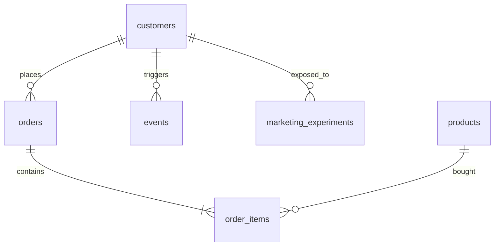

# sql-product-analytics-labs

Hands-on SQL notebooks for product analytics using DuckDB and synthetic ecommerce data. The project is structured for recruiters and hiring managers: deterministic data generation, reproducible notebooks, and rendered HTML reports that showcase joins, windows, funnels, and A/B testing on a marketing experiment.

## Quickstart

```bash
python3 -m venv .venv
source .venv/bin/activate
pip install -r requirements.txt
python src/generate_data.py
jupyter lab
```

The `src/generate_data.py` script regenerates all CSVs under `data/synthetic/` and refreshes `sql/schema.sql` plus `sql/seed.sql`. Each notebook reads those files, loads DuckDB tables, and saves visuals to `reports/` when exported to HTML via `nbconvert`.

## Repository map

- `data/synthetic/`: CSVs generated deterministically with Faker + NumPy.
- `sql/schema.sql`: Table definitions for DuckDB.
- `sql/seed.sql`: COPY commands to load the CSVs.
- `notebooks/`: Four guided labs covering joins, windows, CTE funnels, and marketing A/B tests.
- `reports/`: HTML exports of notebooks (produced with `jupyter nbconvert --to html`).
- `src/generate_data.py`: Data factory script.
- `PowerBI/`: Instructions and a lightweight theme for optional visuals.

## Entity relationship diagram



## Learning path

1. **Joins and KPIs** – revenue by country/month and category rollups.
2. **Window functions** – lag/lead, moving averages, and retention cohorts.
3. **CTEs + funnels** – step-through conversion from visit to purchase.
4. **A/B testing** – two-proportion z-test with confidence intervals.
